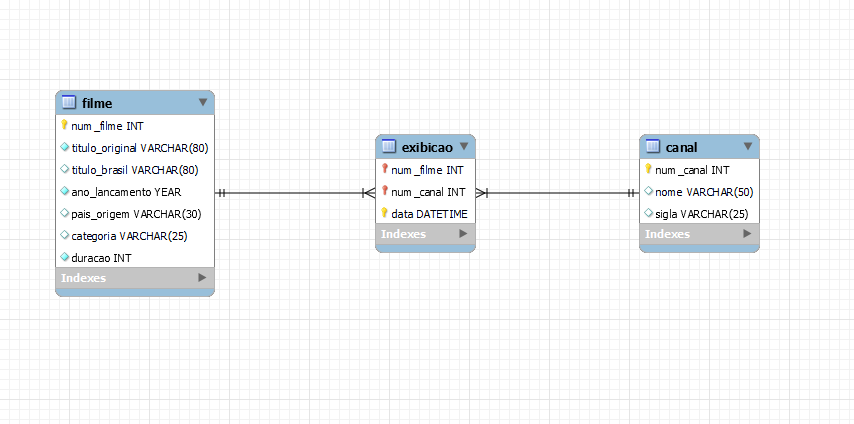

# 🎬 Sistema de Programação de Filmes - MySQL & NoSQL 

### 👥 Integrantes:
- Anna Carolina Bejan
- Edney Santos
- Gleyce Alves
- Matheus Costa
- Mylena Araújo
- Ygor Macêdo

## 📝 Descrição do Projeto

Este projeto tem como objetivo desenvolver um sistema computacional web utilizando o banco de dados relacional MySQL e o framework Streamlit em Python. O sistema implementa as operações básicas de CRUD (Create, Read, Update, Delete) para a gestão de programações de filmes, além de incluir um trigger customizado. Também será abordado o uso de um banco de dados NoSQL, com exemplos práticos das operações CRUD nesse tipo de banco.

## 🗂️ Estrutura do Projeto

- **/src**: Contém os códigos-fonte do projeto.
  - **/mysql_app**: Contém os arquivos relacionados à implementação da aplicação MySQL com Streamlit.
    - **App.py**: Arquivo principal da aplicação.
    - **db.py**: Script de conexão e operações com o banco de dados MySQL.
    - **/pages**: Contém as páginas que implementam as operações CRUD e trigger:
      - **0 Create.py**: Implementa a funcionalidade de criação (Create) no sistema.
      - **1 Read.py**: Implementa a funcionalidade de leitura (Read) no sistema.
      - **2 Update.py**: Implementa a funcionalidade de atualização (Update) no sistema.
      - **3 Delete.py**: Implementa a funcionalidade de exclusão (Delete) no sistema.
      - **4 Trigger.py**: Implementa o trigger customizado no sistema.
  - **/nosql_app**: Diretório reservado para a futura implementação da aplicação NoSQL.

- **/data**: Contém scripts SQL para a configuração do banco de dados.
  - **database_setup.sql**: Script para criar as tabelas e inserir dados no banco MySQL.

- **/docs**: Contém a documentação do projeto.
  - **der.png**: Diagrama Entidade-Relacionamento do banco de dados.

## 🛠️ Pré-requisitos

- **Python 3.8+**
- **MySQL 8.0+**
- **Bibliotecas Python**:
  - streamlit
  - mysql-connector-python
  - redis

Instale as dependências com o seguinte comando:

```bash
pip install -r requirements.txt
```

## 🏃‍♂️ Como Rodar a Aplicação

Siga os passos abaixo para rodar a aplicação corretamente:

### 1. Configurar o Ambiente de Desenvolvimento

Antes de rodar a aplicação, certifique-se de que você tem os seguintes requisitos instalados no seu ambiente:

- **Python 3.x**: [Instalar Python](https://www.python.org/downloads/)
- **Streamlit**: Execute o comando abaixo para instalar o Streamlit:
  
  ```bash
  pip install streamlit
  ```

- **MySQL**: Certifique-se de que o MySQL está instalado e configurado no seu sistema.
  
  - [Instalar MySQL](https://dev.mysql.com/downloads/installer/)

### 2. Configurar o Banco de Dados



Você deve configurar o banco de dados MySQL com o esquema e tabelas necessárias antes de rodar a aplicação. Para isso:

1. Abra o **MySQL Workbench** ou qualquer outro cliente MySQL de sua preferência.
2. Rode o script SQL que está no arquivo `data/database_setup.sql` para criar o banco de dados e popular as tabelas com os dados iniciais. O script contém:

   - Criação do esquema `programacao_filmes`
   - Criação das tabelas `canal`, `filme` e `exibicao`
   - Inserção de dados iniciais nos canais e filmes
   - Criação de um **trigger** para garantir que os filmes tenham uma duração entre 30 minutos e 3 horas e 30 minutos, tanto ao inserir como ao atualizar registros.

Para rodar o script, execute o seguinte comando no MySQL Workbench ou na linha de comando do MySQL:

```sql
source /projeto-iaad-db-filmes/data/database_setup.sql;
```

Ou cole o conteúdo diretamente no MySQL Workbench e execute.

### 📜 Arquivo `data/database_setup.sql`

O arquivo `database_setup.sql` contém todo o script necessário para a configuração inicial do banco de dados MySQL, incluindo a criação das tabelas, triggers e inserção de dados. 

### 3. Rodar a Aplicação

Agora que o banco de dados está configurado, siga os passos abaixo para rodar a aplicação com o **Streamlit**:

1. No terminal, navegue até o diretório onde o arquivo `App.py` está localizado.

2. Execute o seguinte comando no terminal:

    ```bash
    streamlit run App.py
    ```

Isso iniciará o servidor do Streamlit e abrirá a aplicação no seu navegador padrão.

### 4. Acessar a Aplicação

Após rodar o comando acima, a aplicação estará disponível em seu navegador no endereço:

- **http://localhost:8501**

---

Com isso, você terá a aplicação rodando e pronta para ser utilizada.

---
